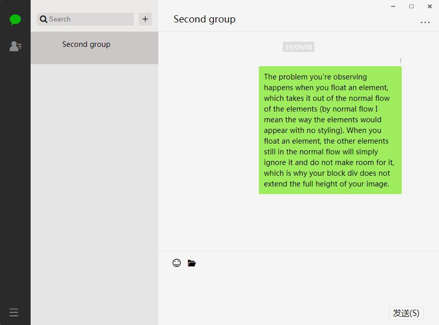

# MMChat

## 前言

本项目是以微信PC端为设计模板制作的。

## 技术栈

  * 编辑器：Visual Studio Code v1.37.1
  * npm: v6.9.2
  * Node.js: v10.16.1
  * 软件框架：Electron、koa2、Vue.js + Vuex + Vue-Router、Webpack
  * 通信模块：[socket.io-client](https://github.com/socketio/socket.io-client)、[socket.io](https://github.com/socketio/socket.io)
  * 数据库：lowdb

## 软件效果图

